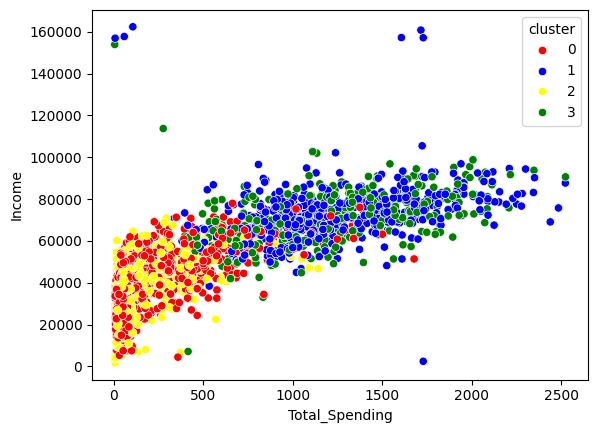
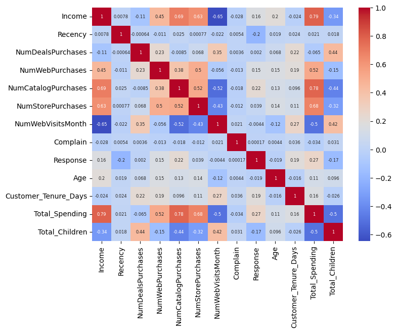
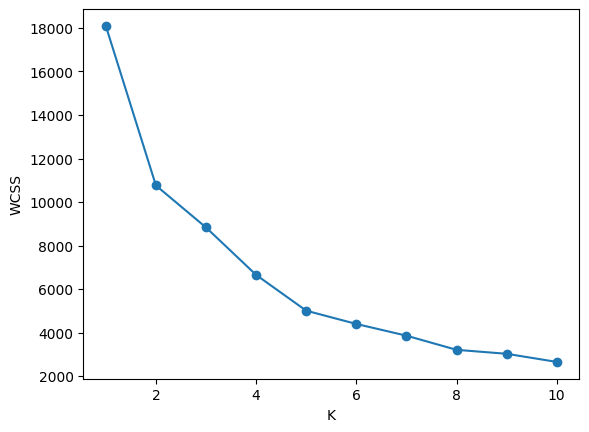
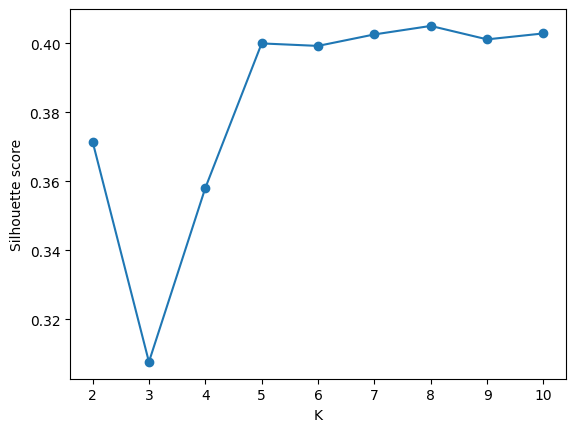
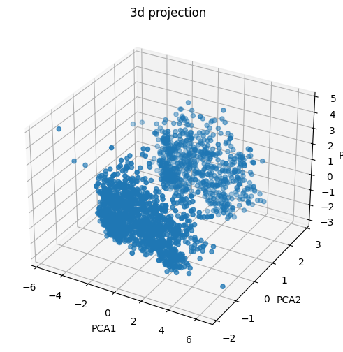
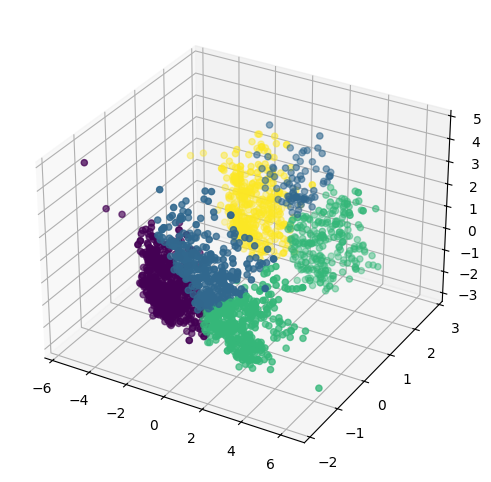
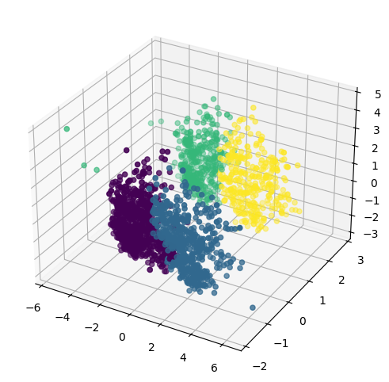

#  Customer Segmentation with Marketing Insights  
[](https://colab.research.google.com/github/omermohd327-svg/Customer-Segmentation-with-Marketing-Insights/blob/main/notebook/customer_segmentation.ipynb)

##  Business Problem

Modern businesses collect vast amounts of customer data but often struggle to understand customer behavior and spending patterns.

Treating all customers the same leads to:

- Inefficient marketing campaigns
- Poor customer retention
- Low personalization
- Wasted marketing budget

This project uses Machine Learning to identify distinct customer groups and generate actionable marketing insights that can improve business decision-making.

---

##  Business Objective

The primary objectives of this project are:

- Identify meaningful customer segments
- Understand customer spending behavior
- Improve marketing effectiveness
- Enable personalized campaigns
- Increase customer retention and lifetime value
- Generate actionable business insights

---

##  Dataset

### Source

Mall Customers Dataset

### Features

- Customer ID
- Gender
- Age
- Annual Income (k$)
- Spending Score (1–100)

These features are used to discover hidden customer patterns and group similar customers together.

---

##  Exploratory Data Analysis (EDA)

Before clustering, exploratory analysis was performed to understand customer demographics and spending behavior.



### Key Observations

- Annual income varies significantly across customers.
- Spending scores are distributed across multiple customer groups.
- Customer behavior appears heterogeneous, suggesting natural segmentation opportunities.

---

##  Correlation Analysis

A correlation heatmap was generated to understand relationships between customer attributes.



### Insights

- Some features show weak relationships, indicating that customer behavior is influenced by multiple factors.
- Clustering can help uncover patterns that traditional correlation analysis cannot reveal.

---

##  Machine Learning Workflow

The project follows the following pipeline:

```text
Customer Data
        ↓
Exploratory Data Analysis
        ↓
Feature Selection
        ↓
Feature Scaling
        ↓
Optimal Cluster Selection
        ↓
K-Means Clustering
        ↓
Cluster Validation
        ↓
Customer Segmentation
        ↓
Business Insights
```

---

##  Data Preprocessing

The following preprocessing steps were performed:

- Data inspection
- Feature selection
- Feature scaling using StandardScaler
- Preparation for clustering algorithms

Feature scaling is essential because clustering algorithms rely on distance-based calculations.

---

##  Finding the Optimal Number of Clusters

The Elbow Method was used to identify the optimal number of clusters.

### Elbow Curve



---

##  Cluster Validation using Silhouette Score

To validate cluster quality, Silhouette Analysis was performed.

### Silhouette Scores




---

##  Customer Segmentation using K-Means

After determining the optimal number of clusters, K-Means Clustering was applied.

---

##  Customer Segment Visualization

To visualize clusters effectively, PCA (Principal Component Analysis) was used.

### PCA Cluster Visualization



### Observation

Distinct customer groups can be observed, indicating meaningful segmentation within the dataset.

---

##  Customer Segment Profiles

The resulting clusters were analyzed to understand customer behavior patterns.



---

##  Segment Interpretation

###  Cluster 0 — High Income, High Spending Customers

**Characteristics**

- Premium customers
- High purchasing power
- Strong engagement

**Business Strategy**

- Loyalty programs
- VIP memberships
- Premium experiences
- Early access to products

---

###  Cluster 1 — High Income, Low Spending Customers

**Characteristics**

- Financially capable customers
- Untapped spending potential

**Business Strategy**

- Personalized promotions
- Targeted campaigns
- Product recommendations

---

###  Cluster 2 — Low Income, Low Spending Customers

**Characteristics**

- Budget-conscious customers
- Lower purchasing frequency

**Business Strategy**

- Discounts
- Bundle offers
- Cost-effective marketing


---

###  Cluster 3 — Medium Income, Medium Spending Customers

**Characteristics**

- Stable customer segment
- Consistent spending behavior

**Business Strategy**

- Retention campaigns
- Cross-selling opportunities
- Seasonal promotions

---

##  Agglomerative Clustering (Comparison)

In addition to K-Means, Agglomerative Clustering was explored as an alternative clustering approach.

### Agglomerative Clustering



### Purpose

Comparing multiple clustering techniques helps evaluate segmentation consistency and cluster quality.

---

##  Business Recommendations

Based on segmentation results:

### VIP Customers

- Reward loyalty
- Offer exclusive benefits
- Increase customer lifetime value

### Opportunity Customers

- Encourage spending through personalized campaigns
- Improve customer engagement

### Budget Customers

- Focus on affordability
- Promote value-driven offerings

### Regular Customers

- Maintain engagement through targeted promotions
- Encourage repeat purchases

---

##  Key Insights

- Customer behavior naturally forms distinct groups.
- Income alone does not determine spending behavior.
- High-income customers are not always high spenders.
- Segmentation enables more effective marketing strategies.
- Data-driven customer understanding improves business outcomes.

---


##  How to Run

### Clone the Repository

```bash
git clone https://github.com/omermohd327-svg/Customer-Segmentation-with-Marketing-Insights.git
cd Customer-Segmentation-with-Marketing-Insights
```

### Install Dependencies

```bash
pip install -r requirements.txt
```

### Launch Jupyter Notebook

```bash
jupyter notebook
```

Open:

```text
notebook/customer_segmentation.ipynb
```

---

##  Tech Stack

- Python
- Pandas
- NumPy
- Matplotlib
- Seaborn
- Scikit-learn
- K-Means Clustering
- Agglomerative Clustering
- StandardScaler
- PCA

---

##  Project Structure

```text
Customer-Segmentation-with-Marketing-Insights/
│
├── data/
│   └── Mall_Customers.csv
│
├── notebook/
│   └── customer_segmentation.ipynb
│
├── models/
│   ├── kmeans_model.pkl
│   └── scaler.pkl
│
├── images/
│   ├── pca_clusters.png
│   ├── elbow_curve.png
│   ├── silhouette_scores.png
│   ├── agglomerative_clustering.png
│   ├── clusters_profiles.png
│   ├── heatmap.png
│   └── eda_distribution.png
│
├── requirements.txt
├── README.md
└── .gitignore
```

---

##  Conclusion

This project demonstrates how Machine Learning can transform raw customer data into meaningful business intelligence.

By identifying distinct customer segments, businesses can improve marketing efficiency, personalize customer experiences, increase retention, and make more informed strategic decisions.
